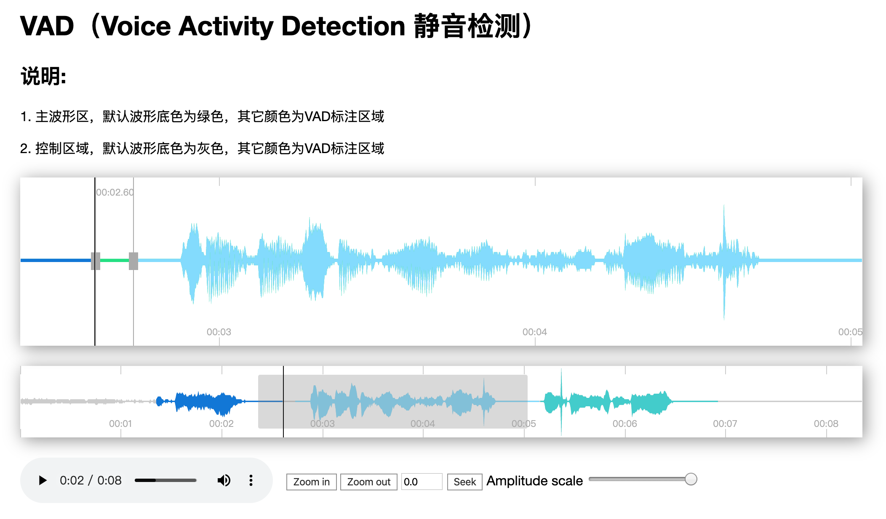

# Audio Suite

音频处理工具套件
1. 辅助调参工具
2. 辅助标注工具
3. 波形直观展示
4. 算法效果检测

Demo
```
virtualenv .env
source .env/bin/activate
pip install requirements.txt
python run_apps.py
```

Feature List

- [X] 静音检测
- [X] 噪声抑制
- [X] 音频滤波

[http://0.0.0.0:5000](http://0.0.0.0:5000/)

静音检测页面:



## WebRTC VAD

```
pip install webrtcvad
```

## FFmpeg

[https://github.com/FFmpeg/FFmpeg](https://github.com/FFmpeg/FFmpeg)

[http://ffmpeg.org](http://ffmpeg.org)

```
brew install ffmpeg
```

```
ffmpeg -i input.mp4 output.avi
```

FFmpeg Tools

- ffmpeg
- ffplay
- ffprobe


## AudioWaveform
```
brew tap bbc/audiowaveform
brew install audiowaveform
```

```
audiowaveform -i apps/static/audio/output_wav.wav -o apps/static/audio/output_wav.dat -b 8
```

## NumPy

```
pip install numpy==1.16.4
```

## SciPy


# Peaks

A client-side JavaScript component to display and interact with audio waveforms in the browser

[https://github.com/bbc/peaks.js](https://github.com/bbc/peaks.js)

Demo
```
git clone git@github.com:bbc/peaks.js.git
cd peaks.js
npm install
npm start
```

and then open your browser at [http://localhost:8080](http://localhost:8080).
